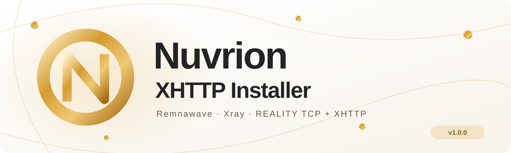

<div align="center">



# Nuvrion XHTTP Installer

### VLESS REALITY TCP + XHTTP · Unix-Socket Decoy для Remnawave

[](https://github.com/nuvrion-kvn/Nuvrion-XHTTP-Installer/actions/workflows/validate.yml)
[](https://github.com/nuvrion-kvn/Nuvrion-XHTTP-Installer/releases/tag/v1.0.0)
[](LICENSE)


**RemnaNode · Xray · REALITY · XHTTP · nginx · PokéHabitat · Auto Tuning · Traffic Control**

</div>

## Назначение

**Nuvrion XHTTP Installer** настраивает серверную часть Remnawave-ноды с двумя
транспортами: VLESS REALITY TCP/RAW и VLESS XHTTP. Один автономный Bash-файл
содержит nginx-шаблоны, сайт PokéHabitat, игровой API, тюнинг, диагностику,
резервное копирование и генератор конфигурации для панели.

Внешний TCP/443 обслуживает Xray. Обычный HTTPS проходит через local Reality
target и PROXY protocol в nginx. Nginx отдаёт сайт либо передаёт XHTTP-запрос
по второму Unix socket. TCP upstream, WebSocket и gRPC в эту схему не добавляются.

Версия **1.0.0** устанавливает Remnanode на чистый сервер и настраивает уже
установленную ноду. На чистом сервере доступны **latest и выбор стабильной версии**.
Для существующей ноды сохраняются образ, Xray, действующие ключи, SSH и настройки.
Сначала показывает диагностику и план, затем запрашивает подтверждение и создаёт
backup. Полный профиль нужно применить в Remnawave отдельно.

## Что входит

- первая установка Remnawave Node с выбором официальной версии и закреплением image ID;
- установка отсутствующих Docker/Compose через APT, без переустановки существующих;
- REALITY TCP/RAW + XHTTP через общий `/dev/shm`;
- nginx HTTPS/HTTP/2, PROXY protocol и обычный HTTP `proxy_pass`;
- автономный PokéHabitat: HTML, JS, изображения, локальный API и SQLite;
- Let's Encrypt, автоматическое продление, staging dry-run и nginx deploy-hook;
- полный Config Profile, настройки двух Host с fingerprint **Firefox** и XHTTP extra;
- cookie-padding на проверенном Xray 26.7.28; все пользовательские extra сохраняются;
- DNS **AdGuard → COMSS**, IPv4, cache и serveStale;
- встроенный Nuvrion Auto Tuning: BBR/fq, TFO, RPS/RFS, ZRAM, buffers, backlog,
  conntrack, системные лимиты, kernel hardening, Fail2ban, security updates, NTP и TRIM;
- Nuvrion Traffic Control: IPv4/IPv6 списки, исключения, статистика, диагностика,
  русское меню `ntc` и автоматическое обновление;
- Two-Way Ping, защита Node API, backup/rollback, безопасное обслуживание APT и очистка;
- диагностика и `--self-check` без изменения работающей конфигурации.

Auto Tuning и Traffic Control встроены как закреплённые snapshots. Шаблоны и код
компонентов не загружаются во время установки. Списки блокировки, APT packages
и ACME используют свои штатные внешние источники. Настройки SSH только проверяются.

## Схема работы


```text
Internet
   |
   v
:443 / Xray (Remnanode, network_mode: host)
   |
   +---- valid REALITY / VLESS -----------> Xray routing
   |
   +---- HTTPS / Reality target, xver: 1
              |
              v
       /dev/shm/nuvrion-xhttp/nginx.sock
              |
              v
            Nginx
              |
              +---- / --------------------> PokéHabitat
              +---- /api/game/ -----------> local game Unix socket
              +---- /api/v3/sync/ ---------> /dev/shm/nuvrion-xhttp/xrxh.socket
                                                    |
                                                    v
                                                Xray XHTTP
```

Защищённый каталог имеет mode `2710` и группу nginx workers; nginx socket —
`0600`, XHTTP — `0660`. В `listen: "/dev/shm/nuvrion-xhttp/xrxh.socket,0660"`
суффикс `0660` задаёт **права**, а не часть имени. Setgid/tmpfiles сохраняют
группу и доступ после пересоздания sockets и перезагрузки.

Старые eGames-пути `/dev/shm/nginx.sock` и `/dev/shm/xrxh.socket,0666` сохраняются
при обычном импорте. Их перенос выполняется явно через `--harden-profile` с
согласованным применением профиля в панели. Общий mount `/dev/shm:/dev/shm:rw`
нужен обоим контейнерам; проверяется совпадение inode внутри каждого.

## Требования

- Ubuntu 24.04.x, root и systemd;
- чистый сервер либо существующий Remnanode с `network_mode: host`;
- проверенная версия: **Remnanode 3.4.2 / Xray 26.7.28**, nginx 1.30;
- домен с A-записью на сервер, IP панели и email для Let's Encrypt;
- SECRET_KEY из панели для новой ноды; для действующей — root-only экспорт Config Profile;
- исходящий доступ к APT, ACME, DoH и выбранным спискам блокировки.

При первой установке меню показывает latest и стабильные версии из официального
Docker registry. Номер также задаётся через `--node-version X.Y.Z`; в запуске
с `--yes` без номера используется latest. Образ закрепляется по точному image ID.
Поддержка XHTTP проверяется штатным Xray из выбранного образа до запуска ноды.
Существующий образ/Xray не обновляются: допустим только `--node-version keep`.
Для других версий core новые cookie-padding настройки автоматически не включаются.

## Загрузка приватного релиза

Репозиторий приватный: анонимная ссылка `raw.githubusercontent.com` не подходит.
Скачайте два файла через авторизованный GitHub или GitHub CLI на своём компьютере:

```bash
gh release download v1.0.0 \
  --repo nuvrion-kvn/Nuvrion-XHTTP-Installer \
  --pattern nuvrion-xhttp-install.sh --pattern SHA256SUMS
scp nuvrion-xhttp-install.sh SHA256SUMS root@SERVER_IP:/root/
```

На сервере:

```bash
cd /root
sha256sum -c SHA256SUMS
sudo bash ./nuvrion-xhttp-install.sh
```

Для работы достаточно **одного Bash-файла**. SHA256SUMS нужен для проверки
скачивания, остальные файлы репозитория — документация и материалы разработчика.

## Установка и меню

| Пункт | Действие |
|---:|---|
| 1 | Установить XHTTP-компоненты |
| 2 | Переустановить / восстановить |
| 3 | Диагностика XHTTP |
| 4 | Удалить собственные XHTTP-компоненты |
| 5 | Восстановить последнюю резервную копию |
| 6 | Обновление Ubuntu, ZRAM и безопасная очистка |
| 0 | Выход |

Перед вопросами объясняется `Д = Да`, `Н = Нет`. До изменений показываются
обнаруженная конфигурация и конкретный план. `--yes` подтверждает показанный
план и автоматический rollback при критической ошибке.

Первая установка: получите SECRET_KEY в панели, сохраните его на сервере в
root-only файл с правами `0600` или введите скрыто в интерактивном меню.
Ключ нельзя передавать аргументом командной строки.

```bash
sudo bash ./nuvrion-xhttp-install.sh --install \
  --domain node.example.com --panel-ip 192.0.2.10 \
  --email admin@example.com --node-tag 'My Node' \
  --node-version latest --secret-key-file /root/node-secret.txt
```

Вместо latest можно указать доступный номер, например `--node-version 3.4.2`.
Firewall ограничивает API **до первого старта** ноды. Остановленные контейнеры,
неоднозначная конфигурация, существующий Compose или занятые 443/2222 прекращают
новую установку без замены файлов. После установки создайте связи ноды с профилем
в панели; до загрузки inbound отображается WAITING_FOR_REMNAWAVE_PROFILE.

Пример с сохранением действующего профиля:

```bash
sudo bash ./nuvrion-xhttp-install.sh --install \
  --domain node.example.com --panel-ip 192.0.2.10 \
  --email admin@example.com --node-tag 'My Node' \
  --node-version keep --profile-input /root/existing-profile.json
```

## Профиль, Host и extra в Remnawave

| Выходной файл | Содержимое |
|---|---|
| `/root/nuvrion-xhttp-profile.json` | Полный Config Profile: два inbound, DNS, routing, outbounds |
| `/root/nuvrion-xhttp-host-settings.txt` | Настройки обоих Host и public Reality key |
| `/root/nuvrion-xhttp-extra.json` | XHTTP extra для проверки/ручного заполнения Host |

JSON содержит private Reality key и сохраняется root-only. Вставьте его в
Config Profile панели, назначьте оба inbound нужной ноде и создайте два Host.
Установщик не редактирует live generated Xray config.

| Настройка | REALITY Host | XHTTP Host |
|---|---|---|
| Address / SNI | Ваш DOMAIN | Ваш DOMAIN |
| Port | 443 | 443 |
| Security | DEFAULT / Reality inbound | TLS |
| Fingerprint | Firefox | Firefox |
| Flow | `xtls-rprx-vision` | пустой |
| ALPN | настройки Reality | `h2`, `http/1.1` |
| XHTTP path / mode | — | `/api/v3/sync/`, `auto` |

Extra уже встроен в `streamSettings.xhttpSettings.extra`. Оставьте Host extra
пустым для наследования. Заполненный Host extra может заменить inbound extra;
при ручном заполнении используйте весь сгенерированный объект.

До применения JSON отображается **WAITING_FOR_REMNAWAVE_PROFILE**: XHTTP socket
создаёт Xray только после загрузки соответствующего inbound. Это промежуточное
состояние, а не завершённая проверка VPN.

## Переустановка и security migration

```bash
sudo bash ./nuvrion-xhttp-install.sh --reinstall --node-version keep
sudo bash ./nuvrion-xhttp-install.sh --reinstall --harden-profile \
  --node-version keep --profile-input /root/existing-profile.json
```

Обычный импорт сохраняет keys, UUID, clients, tags, DNS, routing и custom extra.
`--harden-profile` явно меняет output-пути sockets, DNS и padding; его JSON нужно
применить в панели согласованно с инфраструктурой. Образ ноды не меняется.
При необходимом пересоздании только ноды/nginx выводится предупреждение о
кратком прерывании VPN. Повторный запуск без изменений контейнеры не пересоздаёт.

## Диагностика

```bash
sudo bash ./nuvrion-xhttp-install.sh --diagnose
sudo bash ./nuvrion-xhttp-install.sh --self-check
ntc check
```

Проверяются контейнеры, listeners, mounted sockets/inode/permissions, реально
загруженный nginx config, HTTPS, TLS/SNI, сертификат, renewal, firewall, logs,
ZRAM/RPS и остальные компоненты. `--self-check` не создаёт пользователей и не
выполняет reboot, rollback или package changes.

Состояния: NOT INSTALLED, PARTIALLY INSTALLED, BROKEN,
WAITING_FOR_REMNAWAVE_PROFILE, RUNNING. Успех не объявляется при ошибках validation.

- **HTTP 200** на `/` — штатный decoy PokéHabitat.
- **HTTP 400** на XHTTP path без полноценного клиента ожидаем: backend отверг
  неполный запрос; диагностика сравнивает ответ с прямым Unix backend.
- **HTTP 502/504**, socket not found, connection refused или permission denied
  означают ошибку связи с backend.

Cookie-padding изменяет HTTP-вид ответа, но не гарантирует невидимость для DPI.
Сертификат при неизвестном SNI остаётся действительным только для имён из SAN;
внутренние маршруты требуют совпадения SNI и Host.

## Обновления, ZRAM и очистка

```bash
sudo bash ./nuvrion-xhttp-install.sh --maintain
```

APT обслуживается с показом и проверкой плана. OpenSSH, Docker/containerd/runc
закреплены на время операции; package restarts запрещены, действующие configs и
holds сохраняются. Autoremove затрагивает только проверенные неиспользуемые
пакеты; критические службы, ядра, сертификаты, backup и игровая база защищены.
ZRAM проверяется вместе с модулем загруженного ядра и автозапуском. Если нужен
новый kernel, перезагрузка выполняется отдельно в выбранное пользователем время.

Опции `--no-updates`, `--no-tuning`, `--no-traffic-control`,
`--no-two-way-ping` пропускают соответствующую новую настройку. Уже работающие
чужие компоненты не удаляются и не заменяются молча. SSH остаётся без изменений.

## Backup, удаление и rollback

```bash
sudo bash ./nuvrion-xhttp-install.sh --remove
sudo bash ./nuvrion-xhttp-install.sh --restore
sudo bash ./nuvrion-xhttp-install.sh --restore \
  --backup /root/nuvrion-xhttp-backups/YYYYMMDD-HHMMSS
```

Timestamped backup сохраняет Compose, nginx, decoy, Let's Encrypt, firewall,
units/hooks и manifest. Удаление работает по маркерам и записям владения:
Remnanode, Docker, чужие компоненты, сертификаты, SSH и база игроков сохраняются.
Исходный Compose не заменяется; XHTTP использует отдельный минимальный override.

Rollback infrastructure не меняет панель: при обратном переносе sockets нужно
восстановить также сохранённый Config Profile. Package/kernel upgrades не
откатываются копированием конфигурации.

Журнал: `/var/log/nuvrion-xhttp-installer.log`, без private keys и credentials.

| Exit code | Значение |
|---:|---|
| 0 | Успех/подготовка; проверьте состояние WAITING или RUNNING |
| 1 | Общая ошибка |
| 2 | Неподдерживаемая ОС |
| 3 | Отсутствующая нода или недопустимая смена версии |
| 4 | Certbot / TLS |
| 5 | Nginx config |
| 6 | Unix socket |
| 7 | Firewall |
| 8 | Выполнен rollback |

## Порты

| Порт | Назначение и доступ |
|---|---|
| 443/TCP | Xray, оба пользовательских транспорта и HTTPS decoy |
| 2222/TCP | Node API, только IP панели |
| 80/TCP | Временно для Certbot HTTP-01 |
| Действующий SSH | Администрирование; настройки и ключи сохраняются |

## Сборка и проверки

```bash
python3 -m unittest discover -s tests -p 'test_xhttp*.py' -v
bash -n nuvrion-xhttp-install.sh
shellcheck -S style nuvrion-xhttp-install.sh
python3 tools/build_xhttp.py
sha256sum -c SHA256SUMS
git diff --check
```

Материалы `site/dist` и `site/server/dist` — закреплённая готовая сборка
PokéHabitat; `tools/build_xhttp.py` повторно упаковывает её без сети. Исходный
frontend/game проект доступен в [Vision Installer](https://github.com/nuvrion-kvn/Nuvrion-Vision-Installer).
Готовый standalone Bash не зависит от этих файлов при установке.

Проверены настоящие REALITY/XHTTP-подключения, DNS fallback, HTTP/2, socket
permissions, firewall fault injection, reinstall, rollback и test-node reboot.
215 тестов общего исходного проекта прошли до выделения репозитория; отдельный
XHTTP-набор запускается здесь самостоятельно. HAPP/INCY, публичная подписка
скрытых тестовых Host, чистая ОС без ноды и WAN throughput не подтверждены.

Исправление первой установки в 1.0.0 проверено запуском настоящей Node latest
и 3.4.2 в отдельных приватных Docker fixtures и 60 unit/shell tests на Linux.
Повторный запуск исправленного скрипта на действующей тестовой ноде дал RUNNING,
сайт 200 и XHTTP backend 400, сохранив контейнеры, image/Xray, SSH и профиль.
Полная установка новой ОС с первоначальным Docker/APT и новым ACME issuance
пока не проводилась.

- [Матрица фактических результатов](NUVRION-TEST-RESULTS.md)
- [Технический отчёт](NUVRION-SECURITY-IMPLEMENTATION-REPORT.md)
- [Применение и восстановление](NUVRION-DEPLOYMENT-GUIDE.md)
- [Изменения security-ревизии](NUVRION-SECURITY-CHANGES.diff)
- [Релиз 1.0.0](docs/RELEASE-NOTES-1.0.0.md)

## Источники и авторство

Основная схема REALITY/PROXY protocol — из проверенного
[eGames](https://github.com/eGamesAPI/remnawave-reverse-proxy/tree/fccf1be0d3e139a07f2f492804b97849e0991a41),
XHTTP inbound/HTTP Unix proxy — из
[legiz](https://github.com/legiz-ru/my-remnawave/blob/2af846044e35f61fc4cbf40aa0c78a5518a89313/README.md).
Встроены закреплённые [Auto Tuning](https://github.com/nuvrion-kvn/Nuvrion-Auto-Tuning/tree/cf1dca62884d262575f1995b62cfd90cb4286908)
и [Traffic Control](https://github.com/nuvrion-kvn/Nuvrion-Traffic-Control/tree/7c8bfd3aba5b26ecf628b546c559b27a6fdbadb7).

Автор установщика: **Nuvrion · [nuvrion-kvn](https://github.com/nuvrion-kvn)**.
Оригинальный код — [MIT](LICENSE). Сторонние пакеты и игровые материалы сохраняют
свои лицензии: [notices](THIRD_PARTY_NOTICES.md), [PokéHabitat licenses](site/LICENSES.md).
Для вопросов и ошибок используется GitHub; рабочие секреты не прикладывайте.
