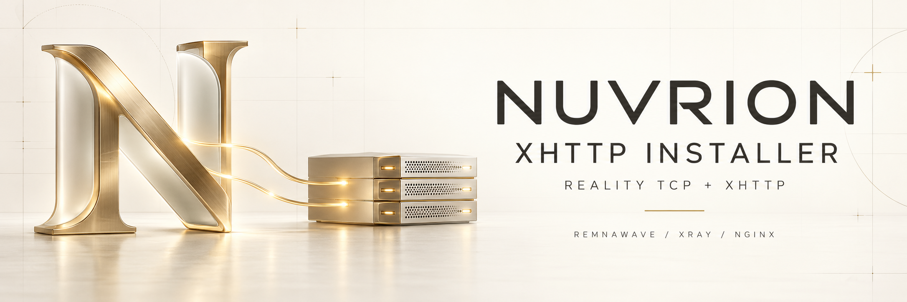
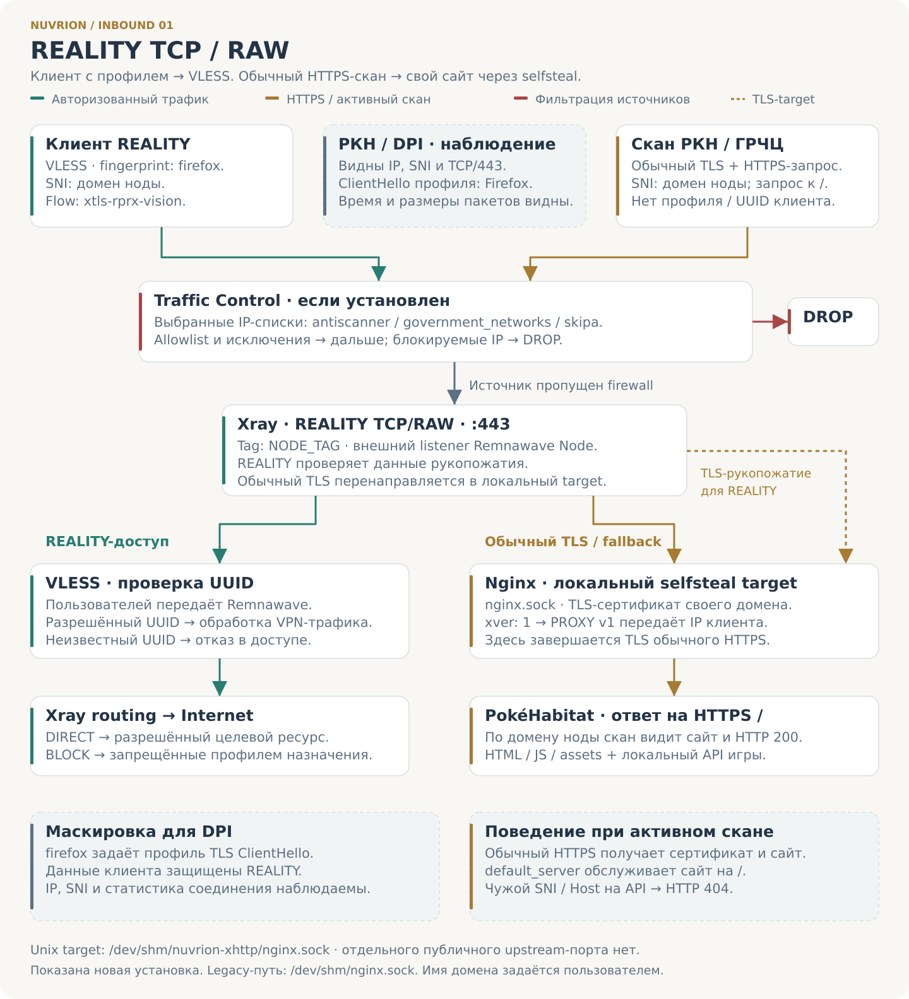
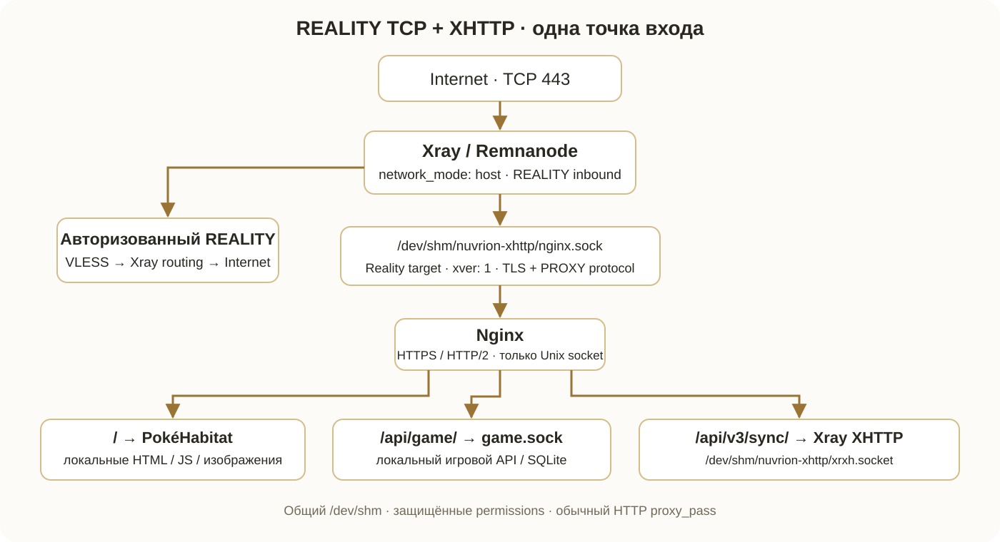
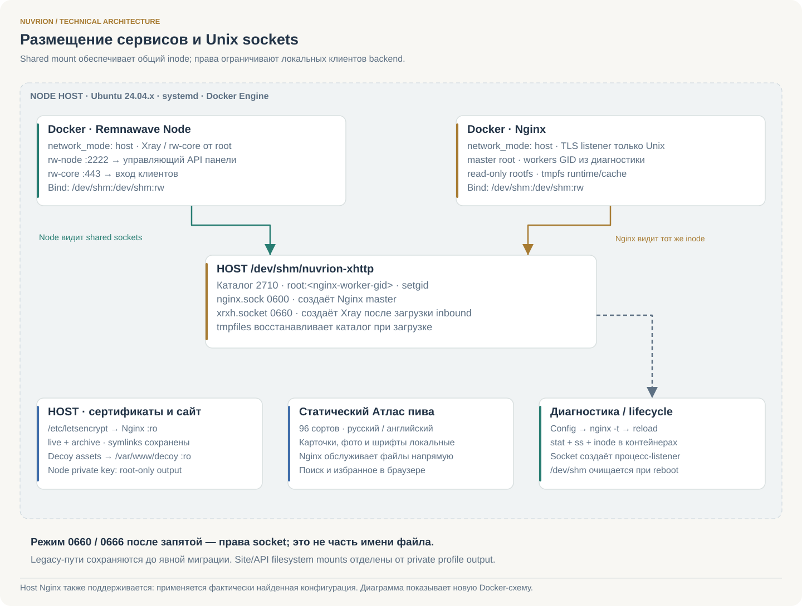
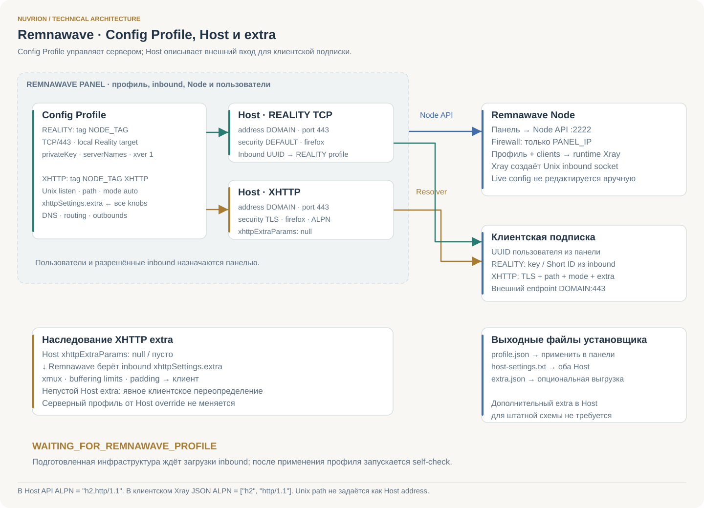
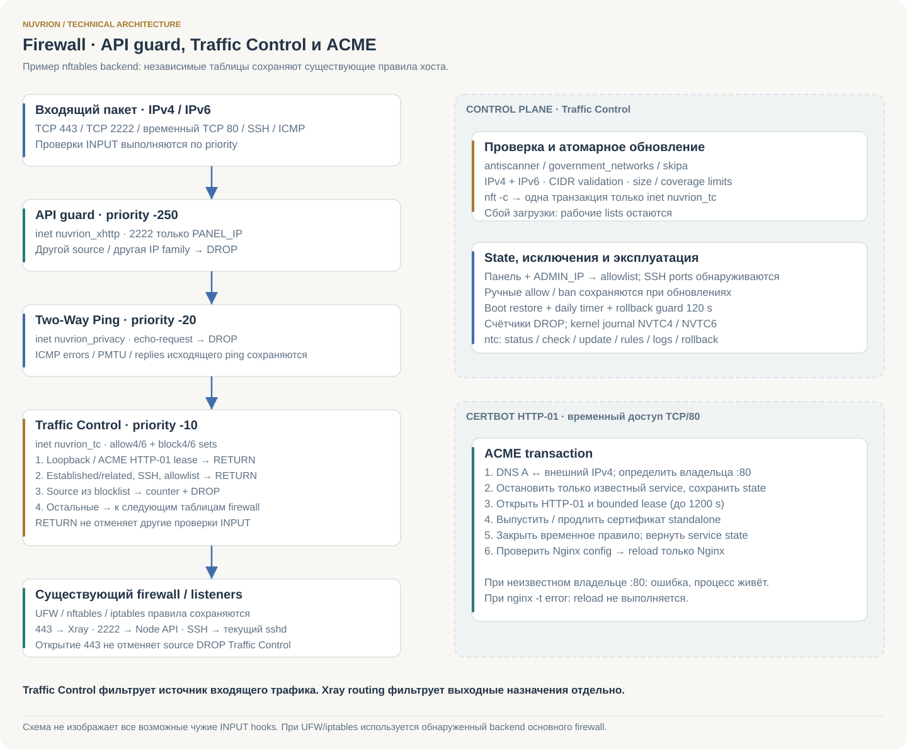

<div align="center">



# Nuvrion XHTTP Installer

**Remnawave Node · VLESS REALITY TCP selfsteal · VLESS XHTTP · Nginx · Unix sockets**

[](https://github.com/nuvrion-kvn/Nuvrion-XHTTP-Installer/actions/workflows/validate.yml)
[](https://raw.githubusercontent.com/nuvrion-kvn/Nuvrion-XHTTP-Installer/main/nuvrion-xhttp-install.sh)
[](LICENSE)


</div>

Авторский установщик **Nuvrion** для **Ubuntu 24.04 LTS**: развёртывание Remnawave Node, REALITY TCP и XHTTP через Nginx и Unix-сокеты, сайт decoy, TLS, оптимизация и диагностика. Поддерживается только ветка Ubuntu 24.04.x.

## Быстрый запуск с GitHub

Скопируйте **одну строку** в SSH-терминал сервера с Ubuntu 24.04.x. Для загрузки нужен `curl`:

```bash
bash -c 'set -e; f=$(mktemp); cleanup(){ rm -f -- "$f"; }; trap cleanup EXIT; curl --proto "=https" --tlsv1.2 -fsSL https://raw.githubusercontent.com/nuvrion-kvn/Nuvrion-XHTTP-Installer/main/install.sh -o "$f"; bash "$f"'
```

Команда скачает и запустит [install.sh](https://raw.githubusercontent.com/nuvrion-kvn/Nuvrion-XHTTP-Installer/main/install.sh). Он проверит ОС, установит средства скачивания, определит текущий коммит `main`, загрузит установщик и SHA-256 из **одного коммита**, проверит целостность и запустит интерактивную установку. Авторизация GitHub не требуется.

<details>
<summary>Развёрнутая команда без install.sh</summary>

Скопируйте весь блок:

```bash
(
  set -Eeuo pipefail
  source /etc/os-release
  [[ ${ID:-} == ubuntu && ${VERSION_ID:-} == 24.04 ]] || {
    printf "Поддерживается только Ubuntu 24.04 LTS; изменения не начаты.\n" >&2
    exit 2
  }
  sudo apt-get update
  sudo apt-get install -y curl ca-certificates python3
  umask 077
  launch_dir=$(mktemp -d /tmp/nuvrion-xhttp-launch.XXXXXXXX)
  cleanup() {
    rm -f -- "$launch_dir/nuvrion-xhttp-install.sh" "$launch_dir/SHA256SUMS"
    rmdir -- "$launch_dir"
  }
  trap cleanup EXIT
  revision=$(curl --proto "=https" --tlsv1.2 -fsSL --connect-timeout 15 --max-time 60 --retry 3 --retry-max-time 180 \
    https://api.github.com/repos/nuvrion-kvn/Nuvrion-XHTTP-Installer/commits/main \
    | python3 -c 'import json, sys; print(json.load(sys.stdin)["sha"])')
  [[ $revision =~ ^[0-9a-f]{40}$ ]] || {
    printf "Не удалось определить коммит установщика.\n" >&2
    exit 1
  }
  source_url=https://raw.githubusercontent.com/nuvrion-kvn/Nuvrion-XHTTP-Installer/$revision
  curl --proto "=https" --tlsv1.2 -fsSL --connect-timeout 15 --max-time 300 --retry 3 --retry-max-time 900 \
    "$source_url/nuvrion-xhttp-install.sh" -o "$launch_dir/nuvrion-xhttp-install.sh"
  curl --proto "=https" --tlsv1.2 -fsSL --connect-timeout 15 --max-time 300 --retry 3 --retry-max-time 900 \
    "$source_url/SHA256SUMS" -o "$launch_dir/SHA256SUMS"
  (cd "$launch_dir" && sha256sum -c SHA256SUMS)
  sudo bash "$launch_dir/nuvrion-xhttp-install.sh" --install
)
```

</details>

[Скачать текущий установщик](https://raw.githubusercontent.com/nuvrion-kvn/Nuvrion-XHTTP-Installer/main/nuvrion-xhttp-install.sh) · [SHA256SUMS](https://raw.githubusercontent.com/nuvrion-kvn/Nuvrion-XHTTP-Installer/main/SHA256SUMS) · [История опубликованных релизов](https://github.com/nuvrion-kvn/Nuvrion-XHTTP-Installer/releases)

После запуска установщик покажет состав компонентов и запросит домен, API-порт ноды, IP панели и секретный ключ. Сначала проверяются DNS и найденная конфигурация, затем показывается план и запрашивается подтверждение изменений. Секретный ключ вводится скрыто. Дальнейшие параметры и применение профиля описаны в [разделе установки](#установка).

## Назначение и состав

Автономный Bash-установщик разворачивает Remnawave Node или подключает XHTTP-инфраструктуру к существующей ноде. Внешний вход обоих транспортов — **TCP/443 в Xray**. REALITY TCP работает с локальным selfsteal target: Nginx принимает перенаправленный TLS-поток через Unix socket. Nginx обслуживает сайт декой и проксирует XHTTP к отдельному Unix inbound Xray.

В файл `nuvrion-xhttp-install.sh` встроены конфигурационные шаблоны, собранный сайт декой с локальным API, генератор Config Profile, Auto Tuning, Traffic Control, Two-Way Ping, диагностика и backup/rollback. При установке не требуется скачивать дополнительные файлы из этого репозитория.

| Подсистема | Результат установки |
|---|---|
| Remnawave Node | Выбор latest или стабильного тега для новой ноды; закрепление точного image ID. У существующей ноды сохраняется образ |
| Транспорты | VLESS REALITY TCP/RAW на `:443` и VLESS XHTTP на Unix socket; `network_mode: host` |
| Nginx | TLS 1.2/1.3, HTTP/2, PROXY protocol, сайт декой и HTTP reverse proxy для XHTTP |
| Сайт декой | Встроенные HTML/JS/изображения, локальный API через Unix socket, SQLite и отдельный systemd-сервис |
| TLS | Let's Encrypt HTTP-01, автоматическое продление, проверка конфигурации и reload Nginx |
| Remnawave | Полный профиль ноды с двумя inbound и встроенным extra; параметры двух Host с fingerprint `firefox` |
| Auto Tuning | Сетевые sysctl, BBR/fq, TFO, RPS/RFS, ZRAM, лимиты, kernel hardening и системное обслуживание |
| Traffic Control | IPv4/IPv6-фильтрация входящих источников по спискам, allowlist, ручные блокировки, статистика и ежедневное обновление |
| Two-Way Ping | Фильтрация входящих echo-request и IPv4 timestamp-request; исходящий ping и ICMP-ошибки сохраняются |
| Эксплуатация | Проверка портов, shared mounts, TLS, backend и журналов; резервные копии, восстановление и удаление собственных компонентов |

Код Auto Tuning и Traffic Control закреплён в установщике. Внешние обращения нужны для системных пакетов, официальных контейнерных образов, ACME, DNS и обновления списков Traffic Control.

**Содержание:** [архитектура](#архитектура-трафика) · [установка](#установка) · [профиль ноды](#шаблон-профиля-ноды) · [шаблоны-host](#шаблоны-host) · [extra](#наследование-extra) · [Auto Tuning](#auto-tuning) · [Traffic Control](#traffic-control) · [диагностика](#диагностика-и-критерии-готовности) · [восстановление](#резервные-копии-удаление-и-восстановление)

## Архитектура трафика

### REALITY TCP / RAW



Inbound `NODE_TAG` слушает **TCP/443**. После проверки REALITY и UUID пользователя трафик поступает в Xray routing. Обычный TLS без авторизации REALITY пересылается к своему Nginx через `nginx.sock`: это локальный **selfsteal target**. Для рукопожатия REALITY Xray также обращается к Nginx; эта связь показана пунктиром. `xver: 1` передаёт исходный IP через PROXY protocol v1.

### XHTTP + TLS



Клиент XHTTP использует обычный **TLS к домену ноды**. Общий listener Xray на TCP/443 пересылает это соединение к Nginx. Nginx завершает TLS, выбирает XHTTP path и отправляет локальный HTTP/1.1 в `xrxh.socket` через `proxy_pass` без buffering. Inbound `NODE_TAG XHTTP` проверяет UUID и применяет Xray routing.

`X-Real-IP` и `X-Forwarded-For` берутся из `$proxy_protocol_addr`; `trustedXForwardedFor` передаёт Xray реальный IP клиента. XHTTP extra наследуется из профиля, cookie-padding включается после проверки совместимости core. Путь `/api/v3/sync/` на схеме — значение по умолчанию; при установке можно задать свой.

### Маскировка и ответы на сканирование

На схемах РКН / DPI обозначает наблюдение за соединением, а активный скан РКН / ГРЧЦ — TLS/HTTPS-проверку без профиля клиента. Показано поведение новой конфигурации, создаваемой установщиком.

| Проверка | Что происходит в этой схеме |
|---|---|
| Пассивное наблюдение DPI | `firefox` задаёт профиль **TLS ClientHello**. Содержимое защищено REALITY или TLS; IP, SNI, размеры пакетов, время и объём соединения остаются видимыми. |
| HTTPS-запрос к `/` по домену ноды | Nginx показывает сертификат собственного домена и **Атлас пива с HTTP 200**. Обычный TLS направляется в сайт через selfsteal. |
| Запрос к API с чужим SNI или Host | **HTTP 404**. Default vhost использует сертификат домена ноды, обслуживает сайт на `/`, а `/api/` возвращает 404; XHTTP также проверяет SNI/Host, старый игровой API возвращает 404. |
| Одиночный запрос на XHTTP path без сессии | Возможен **HTTP 400 от XHTTP backend**. Ответ определяется запросом; работоспособность VPN проверяется авторизованным клиентом. |
| Источник совпал с IP-блок-листом Traffic Control | Если модуль установлен, новое соединение получает **DROP** с учётом allowlist и исключений. Источники вне выбранных списков передаются следующим правилам firewall. |
| Поиск отдельного сетевого XHTTP backend | Nginx и Xray связаны **Unix socket**; дополнительный публичный TCP upstream для XHTTP не создаётся. |

Механизмы TLS и REALITY описаны в официальных документах [REALITY target](https://xtls.github.io/en/config/transports/reality.html#realityobject), [TLS fingerprint](https://xtls.github.io/en/config/transports/tls.html#tlsobject) и коде [REALITY Server](https://github.com/XTLS/REALITY/blob/main/tls.go). Конкретные маршруты сайта/API и фильтрация источников определяются кодом этого установщика. Исходник схем: [tools/draw_inbound_schemes.py](tools/draw_inbound_schemes.py).

### Контейнеры, mounts и права



| Объект | Новая установка | Назначение |
|---|---|---|
| Shared mount | `/dev/shm:/dev/shm:rw` у Node и контейнерного Nginx | Оба процесса видят одинаковые sockets; диагностика сверяет inode внутри контейнеров |
| Socket directory | `/dev/shm/nuvrion-xhttp`, mode `2710`, `root:<nginx-worker-gid>` | Setgid обеспечивает наследование группы; tmpfiles восстанавливает каталог при загрузке |
| REALITY target | `/dev/shm/nuvrion-xhttp/nginx.sock`, mode `0600` | Nginx master создаёт listener; Xray от root подключается с PROXY protocol |
| XHTTP listener | `/dev/shm/nuvrion-xhttp/xrxh.socket,0660` | Xray создаёт socket; Nginx worker подключается по группе |
| Сертификаты | `/etc/letsencrypt:/etc/letsencrypt:ro` в контейнерном Nginx | Используются стандартные `live/DOMAIN/{fullchain,privkey}.pem`, включая ссылки на `archive` |
| Сайт | Каталог декоя → `/var/www/decoy:ro` | Статические файлы без доступа на запись из Nginx |
| Каталог | Только статические файлы в корне сайта Nginx | Атлас пива: 96 сортов, русский/английский, локальные фото и шрифты; Node.js и игровой API не нужны |

В записи `"…/xrxh.socket,0660"` суффикс `0660` — **mode socket, не часть имени файла**. Для ранее установленной схемы с сокетами непосредственно в `/dev/shm` сохраняются `/dev/shm/nginx.sock` и `"/dev/shm/xrxh.socket,0666"`. Перенос на защищённый каталог выполняется только через явную миграцию `--harden-profile`, с применением согласованного профиля в панели.

Создаваемый Nginx использует read-only root filesystem, tmpfs для runtime/cache, `no-new-privileges`, ограничение PID и `cap_drop: ALL` с минимальными capabilities `CHOWN`, `DAC_OVERRIDE`, `SETUID`, `SETGID`. Docker socket и privileged mode не используются. AppArmor и штатные механизмы ядра сохраняются. Существующие service names, mounts и нестандартные параметры сначала анализируются; конфликтующие конфигурации не заменяются автоматически.

### Панель и конфигурация клиента



Config Profile определяет **серверные inbound, DNS и routing**. Host связывает inbound с публичными адресом/портом и параметрами клиентской подписки. Для XHTTP Host задаёт `securityLayer: TLS`, потому что клиент подключается к Nginx через внешний вход Xray. В самом Unix inbound XHTTP `security: tls` не требуется.

Node API использует выбранный порт (**2222 по умолчанию**) — управляющий канал панели, отдельный от пользовательского `:443`. Панель загружает профиль и пользователей в ноду; установщик не изменяет generated/live Xray config. Наличие файла с профилем на диске само по себе не создаёт `xrxh.socket`. На схемах 2222 обозначает значение по умолчанию.

## Требования

- Только Ubuntu 24.04 LTS / 24.04.x, root, systemd, архитектура x86_64 или aarch64. Другие версии Ubuntu и другие дистрибутивы не поддерживаются.
- Домен с A-записью на внешний IPv4 сервера; IP панели Remnawave и email для ACME.
- Для новой ноды — `SECRET_KEY` из панели. Для существующей — экспорт действующего Config Profile в root-only файл.
- Для существующей ноды — Docker Compose и `network_mode: host`. Образ и Xray автоматически не обновляются.
- Доступ к официальным package/registry/ACME endpoints, DoH и источникам выбранных блок-листов.

## Установка

### Получение файла

Для запуска прямо на сервере используйте [готовую команду выше](#быстрый-запуск-с-github). Репозиторий и файлы релиза доступны публично, без аккаунта или токена GitHub.

Если хотите предварительно сохранить файлы на компьютере, получите текущую сборку и её `SHA256SUMS` одним клонированием, затем перенесите их на сервер:

```bash
git clone --depth 1 https://github.com/nuvrion-kvn/Nuvrion-XHTTP-Installer.git
cd Nuvrion-XHTTP-Installer
scp nuvrion-xhttp-install.sh SHA256SUMS root@SERVER_IP:/root/
```

На сервере проверьте целостность и запустите интерактивное меню:

```bash
cd /root
sha256sum -c SHA256SUMS
sudo bash ./nuvrion-xhttp-install.sh
```

Для выполнения нужен один Bash-файл; `SHA256SUMS` используется только для проверки скачивания. Шаблоны ниже служат справочными примерами — установщик генерирует файлы с фактическими параметрами сервера.

| Пункт меню | Операция |
|---:|---|
| 1 | Установить Node при отсутствии и настроить XHTTP-инфраструктуру |
| 2 | Переустановить / восстановить компоненты |
| 3 | Диагностика XHTTP |
| 4 | Удалить компоненты установщика |
| 5 | Восстановить последнюю резервную копию |
| 6 | Обслужить Ubuntu, ZRAM и выполнить безопасную очистку |
| 0 | Выход |

До записи конфигурации выполняются диагностика, показ найденных сервисов и план изменений. После подтверждения создаётся timestamped backup. `--yes` подтверждает показанный план и автоматический rollback при критической ошибке.

В начале выводятся название, лицензия MIT, создатель **Nuvrion / nuvrion-kvn** и состав устанавливаемых компонентов. Затем вводятся данные; русские подсказки выделены **жирным жёлтым** цветом:

1. Домен сайта декой / SNI.
2. Порт API ноды для подключения панели — **2222 по умолчанию**.
3. IP панели Remnawave.
4. Секретный ключ ноды — скрытый ввод, без вывода в журнал.

Дополнительно запрашиваются email Let's Encrypt, tag и XHTTP path. Введённые данные используются при создании конфигурации, firewall, сертификата и выходного профиля. «Порт панели» в установщике означает **Node API port на сервере ноды**, а не HTTPS-порт сайта панели. В карточке Node в Remnawave укажите этот же порт; два пользовательских Host продолжают использовать TCP/443.

До изменения конфигурации все обнаруженные DNS A-записи сравниваются с внешним IPv4 сервера. Отсутствие записи, невозможность определить IP или любой посторонний A-адрес **отменяют установку** с предупреждением. Обойти проверку через `--yes` нельзя. Исправьте DNS и повторите запуск.

### Новая нода

Версии выбираются из официального Docker registry: latest либо стабильный тег. После pull образ закрепляется по image ID. Если Docker/Compose отсутствуют, устанавливаются необходимые APT-пакеты; действующая установка Docker сохраняется.

SECRET_KEY вводится скрыто либо читается из файла с правами `0600`. Секрет не передаётся аргументом командной строки.

```bash
sudo bash ./nuvrion-xhttp-install.sh --install \
  --domain node.example.com --panel-port 2222 --panel-ip 192.0.2.10 \
  --email admin@example.com --node-tag 'My Node' \
  --node-version latest --secret-key-file /root/node-secret.txt
```

Конкретный доступный тег задаётся через `--node-version 3.4.2`. В интерактивном режиме доступен выбор; при `--yes` без номера новая нода использует latest. Доступ к API ограничивается **до первого старта**. Найденные Compose/container conflicts или занятые `:443` / выбранный API-порт прерывают новую установку без замены чужих файлов. Например, `--panel-port 3222` создаёт `NODE_PORT=3222`, ограничивает этот порт IP панели и сохраняет его для диагностики и автозапуска firewall.

### Существующая нода

```bash
sudo bash ./nuvrion-xhttp-install.sh --install \
  --domain node.example.com --panel-ip 192.0.2.10 \
  --email admin@example.com --node-tag 'My Node' \
  --node-version keep --profile-input /root/existing-profile.json
```

Исходный Compose сохраняется; необходимые изменения вносятся отдельным override. Образ, Reality key, clients, tags и пользовательские настройки импортируемого профиля сохраняются. Для существующей ноды допустим `--node-version keep`; смена версии требует отдельной операции вне этого установщика.

API-порт установленной ноды определяется автоматически и предлагается при вводе. Его изменение в этом режиме отклоняется. В скрытом запросе ключа Enter сохраняет действующий `SECRET_KEY`; введённый ключ или `--secret-key-file` проверяется на совпадение, без замены credentials. В неинтерактивном режиме ключ существующей ноды повторно передавать не требуется.

При изменении только Nginx config выполняются проверка и reload. Пересоздаётся только сервис, которому требуется новый mount/Compose-параметр. Перед затрагиванием ноды выводится предупреждение о возможном коротком прерывании VPN.

## Применение в Remnawave

В конце успешной установки или переустановки полный сгенерированный JSON профиля и настройки обоих Host выводятся в терминал для копирования, без сокращения и переноса строк самим установщиком. Профиль содержит private Reality key; его содержимое не записывается в журнал установщика. Отдельный блок или путь к extra в итоговом выводе не показывается: параметры уже встроены в `xhttpSettings.extra`, поле extra у Host остаётся пустым.

| Выходной файл | Назначение |
|---|---|
| `/root/nuvrion-xhttp-profile.json` | Готовый Config Profile с private Reality key и встроенным `xhttpSettings.extra`; права root-only |
| `/root/nuvrion-xhttp-host-settings.txt` | Фактические параметры двух Host и public Reality key |
| `/root/nuvrion-xhttp-extra.json` | Необязательная выгрузка клиентских extra-параметров для диагностики или явного Host override |

1. Создайте или обновите Config Profile содержимым **сгенерированного** `/root/nuvrion-xhttp-profile.json`.
2. Назначьте ноде оба inbound этого профиля. Пользователи заполняются панелью; `clients: []` в шаблоне сохраняется.
3. Создайте два Host, каждый с соответствующим inbound, и свяжите их с этой нодой.
4. Для XHTTP задайте TLS, Firefox, ALPN `h2,http/1.1`; поле extra оставьте пустым.
5. После загрузки профиля повторите `--self-check`; окончательное рабочее состояние — `RUNNING`.

### Шаблон профиля ноды

Копируемый JSON также сохранён в [templates/node-profile.json](templates/node-profile.json). Он воспроизводит генератор **новой** ноды с защищёнными sockets и cookie-padding для проверенного core. Для действующей legacy-ноды используйте её сгенерированный профиль, поскольку пути и права могут отличаться.

| Подстановка | Что указать |
|---|---|
| `DOMAIN` | Домен сертификата и SNI, например `node.example.com` |
| `NODE_TAG` | Tag REALITY inbound; связанный XHTTP tag — `NODE_TAG XHTTP`. Замените также tags во всех routing rules |
| `REPLACE_WITH_NODE_REALITY_PRIVATE_KEY` | Индивидуальный private key, сгенерированный Xray этой ноды; для существующей ноды сохраните её ключ |

**Не применяйте шаблон до подстановки значений.** Общего предустановленного ключа или UUID пользователя в нём нет. Public key панель получает из выбранного REALITY inbound; он также выводится установщиком.

```json
{
  "log": {
    "access": "none",
    "dnsLog": false,
    "loglevel": "warning"
  },
  "dns": {
    "servers": [
      {
        "address": "https+local://dns.adguard-dns.com/dns-query",
        "timeoutMs": 2500,
        "queryStrategy": "UseIPv4"
      },
      {
        "address": "https+local://dns.comss.one/dns-query",
        "timeoutMs": 2000,
        "queryStrategy": "UseIPv4"
      }
    ],
    "serveStale": true,
    "disableCache": false,
    "queryStrategy": "UseIPv4",
    "disableFallback": false,
    "serveExpiredTTL": 600,
    "enableParallelQuery": false
  },
  "inbounds": [
    {
      "tag": "NODE_TAG",
      "port": 443,
      "protocol": "vless",
      "settings": {
        "clients": [],
        "decryption": "none"
      },
      "sniffing": {
        "enabled": true,
        "routeOnly": true,
        "destOverride": [
          "http",
          "tls",
          "quic"
        ]
      },
      "streamSettings": {
        "network": "raw",
        "sockopt": {
          "tcpFastOpen": true,
          "tcpcongestion": "bbr",
          "tcpKeepAliveIdle": 60,
          "tcpKeepAliveInterval": 30
        },
        "security": "reality",
        "realitySettings": {
          "show": false,
          "xver": 1,
          "target": "/dev/shm/nuvrion-xhttp/nginx.sock",
          "spiderX": "",
          "minClientVer": "0.0.0",
          "shortIds": [
            ""
          ],
          "privateKey": "REPLACE_WITH_NODE_REALITY_PRIVATE_KEY",
          "serverNames": [
            "DOMAIN"
          ]
        }
      }
    },
    {
      "tag": "NODE_TAG XHTTP",
      "listen": "/dev/shm/nuvrion-xhttp/xrxh.socket,0660",
      "protocol": "vless",
      "settings": {
        "clients": [],
        "fallbacks": [],
        "decryption": "none"
      },
      "sniffing": {
        "enabled": true,
        "routeOnly": true,
        "destOverride": [
          "http",
          "tls",
          "quic"
        ]
      },
      "streamSettings": {
        "network": "xhttp",
        "xhttpSettings": {
          "mode": "auto",
          "path": "/api/v3/sync/",
          "extra": {
            "noSSEHeader": true,
            "xPaddingBytes": "100-1000",
            "scMaxBufferedPosts": 30,
            "scMaxEachPostBytes": 1000000,
            "scStreamUpServerSecs": "20-80",
            "scMinPostsIntervalMs": 30,
            "noGRPCHeader": false,
            "xmux": {
              "cMaxReuseTimes": 0,
              "maxConcurrency": "16-32",
              "maxConnections": 0,
              "hKeepAlivePeriod": 0,
              "hMaxRequestTimes": "600-900",
              "hMaxReusableSecs": "1800-3000"
            },
            "xPaddingObfsMode": true,
            "xPaddingPlacement": "cookie",
            "xPaddingKey": "site_session",
            "xPaddingMethod": "tokenish"
          }
        },
        "sockopt": {
          "trustedXForwardedFor": [
            "X-Forwarded-For"
          ]
        }
      }
    }
  ],
  "outbounds": [
    {
      "tag": "DIRECT",
      "protocol": "freedom",
      "settings": {
        "domainStrategy": "UseIPv4"
      },
      "streamSettings": {
        "sockopt": {
          "tcpFastOpen": true,
          "tcpcongestion": "bbr",
          "tcpKeepAliveIdle": 60,
          "tcpKeepAliveInterval": 30
        }
      }
    },
    {
      "tag": "BLOCK",
      "protocol": "blackhole"
    }
  ],
  "routing": {
    "rules": [
      {
        "port": "443",
        "type": "field",
        "network": "udp",
        "inboundTag": [
          "NODE_TAG",
          "NODE_TAG XHTTP"
        ],
        "outboundTag": "BLOCK"
      },
      {
        "port": "25",
        "type": "field",
        "network": "tcp",
        "inboundTag": [
          "NODE_TAG",
          "NODE_TAG XHTTP"
        ],
        "outboundTag": "BLOCK"
      },
      {
        "type": "field",
        "protocol": [
          "bittorrent"
        ],
        "inboundTag": [
          "NODE_TAG",
          "NODE_TAG XHTTP"
        ],
        "outboundTag": "BLOCK"
      },
      {
        "ip": [
          "geoip:private"
        ],
        "type": "field",
        "inboundTag": [
          "NODE_TAG",
          "NODE_TAG XHTTP"
        ],
        "outboundTag": "BLOCK"
      },
      {
        "type": "field",
        "domain": [
          "geosite:private"
        ],
        "inboundTag": [
          "NODE_TAG",
          "NODE_TAG XHTTP"
        ],
        "outboundTag": "BLOCK"
      },
      {
        "type": "field",
        "domain": [
          "geosite:category-ads-all",
          "domain:analytics.google.com",
          "domain:adjust.net.in",
          "domain:amplitude.com",
          "domain:metrika.yandex.ru",
          "domain:mytracker.ru"
        ],
        "inboundTag": [
          "NODE_TAG",
          "NODE_TAG XHTTP"
        ],
        "outboundTag": "BLOCK"
      }
    ],
    "domainMatcher": "hybrid",
    "domainStrategy": "AsIs"
  }
}
```

В XHTTP `path` и `mode` находятся в `xhttpSettings`, остальные transport knobs — в **`xhttpSettings.extra`**. Новая DNS-конфигурация использует AdGuard и COMSS по DoH, IPv4, cache и serveStale. Routing блокирует UDP/443 (QUIC), TCP/25 (SMTP), распознанный BitTorrent, private IP/domain и перечисленные рекламные/аналитические домены. Это правила выхода Xray для обоих inbound; фильтрация входящих источников Traffic Control работает отдельно.

### Шаблоны Host

#### Настройки REALITY TCP Host в Remnawave

```text
Адрес:          DOMAIN
Порт:           443
SNI:            DOMAIN
Security Layer: DEFAULT
Отпечаток:      firefox
ALPN:           Наследовать из inbound
Inbound:        NODE_TAG
```

`DEFAULT` наследует REALITY из выбранного inbound. Transport — TCP/RAW, flow в клиенте — `xtls-rprx-vision`. Поля Host, Path и XHTTP extra parameters оставьте пустыми.

#### Настройки XHTTP Host в Remnawave

```text
Адрес:          DOMAIN
Порт:           443
SNI:            DOMAIN
Security Layer: TLS (Transport Layer Security)
Отпечаток:      firefox
ALPN:           h2,http/1.1
Inbound:        NODE_TAG XHTTP
```

TLS завершается в Nginx. В поле Host укажите `DOMAIN`, в Path — `/api/v3/sync/` или свой путь из профиля. Transport — XHTTP, mode — `auto` из inbound, flow оставьте пустым. **XHTTP extra parameters оставьте пустым для наследования extra из профиля.**

Адрес и SNI обоих Host должны совпадать с доменом ноды (`DOMAIN` в профиле). Внешний порт обоих Host — `443`. В Inbound выберите соответствующий тег из профиля и назначьте оба inbound ноде.

### Наследование extra

**Extra уже находится в профиле ноды; отдельное заполнение extra в Host для этой схемы не требуется.** Remnawave берёт `streamSettings.xhttpSettings.extra` выбранного inbound при построении клиентской подписки. Такое поведение подтверждено в [официальном resolver Remnawave](https://github.com/remnawave/backend/blob/010b365ab1fabea01192b5e6ade4e98e66ee1dbd/src/modules/subscription-template/resolve-proxy/resolve-proxy-config.service.ts).

Непустой Host extra является явным переопределением клиентского объекта. Он не изменяет серверный профиль и может заменить унаследованные параметры. Используйте его только при намеренной настройке отдельного Host. Файл `/root/nuvrion-xhttp-extra.json` содержит выгрузку клиентских knobs; это не третий обязательный шаг настройки и не полная копия серверного extra. Stream separation и `downloadSettings` по умолчанию не добавляются.

## Auto Tuning

Встроен [Nuvrion Auto Tuning](https://github.com/nuvrion-kvn/Nuvrion-Auto-Tuning/tree/cf1dca62884d262575f1995b62cfd90cb4286908) как закреплённый snapshot. Профиль рассчитывается по CPU, RAM, ядру, сетевым интерфейсам и текущей конфигурации, поэтому фиксированный набор чисел для всех VPS не применяется.

| Компонент | Что выполняется | Условия и проверка |
|---|---|---|
| TCP congestion / qdisc | Проверка `tcp_bbr`, выбор BBR и `fq` | Только при поддержке ядра; существующий допустимый congestion control не подменяется неподдерживаемым значением |
| TCP Fast Open | `net.ipv4.tcp_fastopen=3`, sockopt в профиле Xray | Постоянный sysctl; клиентская поддержка TFO зависит от ОС/сети |
| TCP/UDP buffers | Настройка `rmem/wmem`, `tcp_rmem/tcp_wmem`, минимальных UDP buffers | Значения из CPU/RAM-профиля; проверяются реально применённые sysctl |
| Очереди и backlog | `somaxconn`, SYN backlog, `netdev_max_backlog`, TCP keepalive | Настройки очередей и таймаутов; это не гарантированное увеличение скорости канала |
| Conntrack | Проверка модуля, лимита записей и hashsize | Размеры согласуются с RAM и поддержкой ядра; восстановление после загрузки |
| Исходящие порты | Диапазон `10240–65535`, резервирование обнаруженных service ports | Активные listeners исключаются из автоматического выделения ephemeral ports |
| RPS/RFS | CPU masks RX-очередей и `rps_sock_flow_entries` | `nuvrion-rps.service`, проверка масок и автозапуска; учитываются доступные очереди |
| Лимиты файлов | Профиль `nofile` до 1 048 576, системные и Compose-лимиты | Сохраняются посторонние параметры; применение к работающему процессу проверяется отдельно |
| ZRAM | Swap в сжатой памяти, размер по RAM, `zstd` либо поддерживаемый fallback, priority `100` | `nuvrion-zram.service`, проверка модуля, активного swap и автозапуска; чужой работающий ZRAM manager сохраняется |
| Network hardening | Запрет redirects/source-route IPv4/IPv6, игнорирование broadcast ICMP и bogus ICMP errors | IPv6 не отключается; строгий глобальный `rp_filter` не навязывается |
| Kernel hardening | `dmesg_restrict`, `kptr_restrict`, protected hardlinks/symlinks/FIFOs/regular files | Более строгие существующие значения сохраняются; AppArmor/seccomp не отключаются |
| Fail2ban | Установка/проверка защиты SSH jail | Конфигурация Fail2ban отдельно от настроек аутентификации sshd |
| Security updates | Настройка unattended-upgrades и проверка APT timers | Без принудительной перезагрузки; существующая политика reboot учитывается |
| Время и TRIM | Проверка NTP, доступного time service и `fstrim.timer` | TRIM только при поддержке discard; пользовательские mask не отменяются |
| Аудит системы | Диск, inode, filesystem, журналы, сертификаты, pending reboot | Итоговый отчёт и проверка после загрузки |

Основной sysctl-профиль: `/etc/sysctl.d/99-zzzz-nuvrion-performance.conf`. `nuvrion-performance-sysctl.service` восстанавливает значения после старта Docker; TFO закрепляется отдельным профилем. RPS и ZRAM имеют собственные setup scripts и units. Отчёт интеграции сохраняется в `/opt/remnanode/nuvrion-xhttp/tuning-report.log`; tuning snapshots — в `/var/lib/nuvrion-tuning`.

Если у загруженного ядра нет рабочего модуля ZRAM, дополнительные модули устанавливаются через проверяемый план APT. Если пакет старого ядра уже недоступен, установщик проверяет уже установленное более новое ядро того же типа, его образ, initrd и модуль ZRAM, затем подготавливает helper и включённую службу автозапуска. Такой результат отмечается как ожидание перезагрузки; активным ZRAM считается только подтверждённый swap с рабочим автозапуском. Автоматической перезагрузки нет; после неё выполняется `--diagnose`.

Интеграция передаёт firewall-управление основному установщику и запрещает vendor-коду лишние restart/recreate Docker, Node и Xray. В этом установщике **порт, ключи и параметры аутентификации SSH сохраняются**: модуль key-only SSH из самостоятельного Auto Tuning отключён. Проверка SSH и Fail2ban остаётся включённой. `--no-tuning` пропускает применение Auto Tuning, но не отключает базовую настройку XHTTP/firewall/TLS.

## Traffic Control

Встроен [Nuvrion Traffic Control](https://github.com/nuvrion-kvn/Nuvrion-Traffic-Control/tree/7c8bfd3aba5b26ecf628b546c559b27a6fdbadb7). Компонент фильтрует **адреса источников входящих соединений** на хосте через nftables; он не является лимитером пропускной способности и не заменяет правила выходного routing Xray.



### Списки и порядок обработки

Источники — `antiscanner.list`, `government_networks.list` и `skipa.list` из [traffic-guard-lists](https://github.com/shadow-netlab/traffic-guard-lists/tree/main/public). Имена списков описывают источник данных, а не гарантию идентификации каждого сканера или организации.

- Загружаются все три списка; принимаются IPv4/IPv6 и CIDR. Проверяются синтаксис, лимит размера 8 MiB и максимум 150 000 записей на список. Некорректная загрузка не заменяет рабочий набор частичным.
- Сети нормализуются и объединяются. Набор, покрывающий весь IPv4 или весь IPv6, отклоняется.
- Правила публикуются одной транзакцией после `nft -c`. Управляется только таблица `inet nuvrion_tc`; существующий firewall не сбрасывается.
- В цепочке `input`, priority `-10`, сначала исключаются loopback, established/related, найденные SSH-порты и allowlist. Затем адреса из blocklist получают counter и DROP.
- IP панели и администратора добавляются в allowlist. Если адрес администратора не удалось определить из SSH-сессии, он запрашивается или задаётся `--admin-ip`; `--ssh-port` задаёт исключение фильтра, не меняет порт sshd.
- Исключение в Traffic Control означает пропуск **его** проверки. Оно не отменяет ограничение выбранного Node API port и другие таблицы firewall.

При установке через XHTTP Installer Traffic Control получает все параметры автоматически и возвращает управление установщику без открытия меню и нажатия `0`. Интерактивное меню доступно отдельно командой `ntc`.

Автозапуск: `nuvrion-traffic-control.service`. Обновление: `nuvrion-traffic-control-update.timer` — через 15 минут после загрузки, далее раз в сутки с random delay до 30 минут. При активации используется страховочный rollback timer на 120 секунд; успешная проверка завершает активацию. Ручные ban/allow и настройки сохраняются при обновлениях.

Журнал блокировок использует kernel journal, префиксы `NVTC4`/`NVTC6`, rate limit `5/minute`, burst `10`. DROP counters учитывают заблокированные пакеты независимо от ограничения журналирования. Команды изменения сериализуются lock-файлом.

### Управление

```bash
sudo ntc                         # русское интерактивное меню
sudo ntc check                   # диагностика компонента
sudo ntc status                  # состояние, списки и timers
sudo ntc rules                   # текущие nftables rules
sudo ntc logs                    # последние блокировки
sudo ntc top --no-resolve         # статистика без внешнего RDAP lookup
sudo ntc update                  # обновить все списки
sudo ntc allow 192.0.2.20         # добавить доверенный источник
sudo ntc disallow 192.0.2.20      # убрать исключение
sudo ntc ban 198.51.100.0/24      # ручная блокировка сети
sudo ntc unban 198.51.100.0/24    # убрать ручную блокировку
sudo ntc disable                 # выключить фильтрацию компонента
sudo ntc activate                # включить фильтрацию с проверками
sudo ntc restore                 # восстановить правила из сохранённого state
sudo ntc repair --yes            # восстановить служебные файлы компонента
sudo ntc rollback               # вернуть предыдущий набор
```

Состояние хранится в `/var/lib/nuvrion-traffic-control/state.json`, исполняемый файл — `/usr/local/bin/nuvrion-traffic-control`, shortcut — `ntc`. Уже существующий сторонний Traffic Control обнаруживается до записи. `--no-traffic-control` пропускает его новую установку; существующая фильтрация не удаляется.

### Two-Way Ping и доступ к API

Two-Way Ping — отдельный сервис `nuvrion-two-way-ping.service` и таблица `inet nuvrion_privacy` с priority `-20`. Отбрасываются входящие ICMPv4/v6 echo-request и ICMPv4 timestamp-request. Ответы на исходящий ping, ICMP-ошибки и механизмы PMTU сохраняются. TCP/443 продолжает отвечать пользователям; это не режим полной сетевой невидимости. Новая настройка пропускается через `--no-two-way-ping`.

Основной firewall определяется до изменений: активный UFW, nftables или iptables. Добавляются только необходимые правила; сохраняется dump для восстановления. API-порт и IP панели берутся из введённых данных. При nft backend отдельный API guard с priority `-250` разрешает выбранный API-порт только IP панели и отбрасывает остальные источники, включая другую IP family. UFW и iptables используют те же параметры. Правило открытия 443 не отменяет блок-листы Traffic Control.

| Порт / канал | Политика |
|---|---|
| `443/TCP` | Пользовательские REALITY, XHTTP и HTTPS сайта декой |
| Выбранный API-порт / TCP, default `2222` | Node API, только IP панели |
| `80/TCP` | Временно на время ACME HTTP-01; после операции правило закрывается |
| Действующий SSH | Существующие настройки; исключение в Traffic Control и защита Fail2ban |
| Unix sockets | Локальная связь процессов, без дополнительных публичных upstream-портов |

## TLS и продление сертификата

Перед выпуском определяется внешний IPv4, запрашиваются DNS A-record и проверяется соответствие домена серверу. Несовпадение отменяет установку до ACME и изменения конфигурации. Nginx читает стандартные Let's Encrypt paths; сертификаты не копируются в отдельный каталог.

Для standalone Certbot определяется владелец `:80`. Известный сервис останавливается адресно и возвращается в исходное состояние. Неизвестный процесс не завершается: установка выдаёт ошибку. Для HTTP-01 firewall и Traffic Control получают временное исключение; ACME lease ограничен 1200 секундами. После операции закрывается временный доступ и восстанавливается сервис.

Certbot timer выполняет renew. Deploy-hook сначала проверяет Nginx config, затем reload **только Nginx**. При невалидной конфигурации reload не выполняется. Диагностика проверяет сертификат/SAN/expiry, timer, hooks и staging dry-run; Node ради renew не перезапускается.

## Диагностика и критерии готовности

```bash
sudo bash ./nuvrion-xhttp-install.sh --diagnose
sudo bash ./nuvrion-xhttp-install.sh --self-check
```

Диагностика читает OS/kernel/uptime, внешний IP и DNS, версии Docker/Compose/Node/Xray, контейнеры, listeners, socket permissions, mounts, Nginx config, сертификат, certbot timer, firewall, HTTP-ответы и последние ошибки. `--self-check` выполняет автоматические проверки без изменений конфигурации, создания пользователей или reboot.

| Проверка | Рабочий результат |
|---|---|
| Node / API | Контейнер UP; выбранный API-порт слушает `rw-node` и ограничен IP панели |
| Внешний вход | `:443` обслуживает Xray |
| REALITY target | `nginx.sock` существует; listener и доступ из Node подтверждены |
| XHTTP backend | `xrxh.socket` существует после применения профиля; совпадение inode и доступ worker из Nginx подтверждены |
| Nginx | Config test успешен; загруженный config содержит нужный path и Unix `proxy_pass` |
| Сайт декой | HTTPS `/` возвращает `200`; TLS/SNI проверяются |
| XHTTP route | Ответ совпадает с прямым Unix backend; нет `502/504`, refused или permission errors |
| TLS / renew | Действующий сертификат, корректные SAN и настроенный renewal |
| Система | Firewall, SSH, ZRAM/RPS и включённые компоненты проходят соответствующие проверки |
| Logs | Нет свежих failed-to-listen, duplicate inbound, invalid config или ошибок socket upstream |

**HTTP 400 на XHTTP path** от одиночного curl ожидаем: запрос без сессии XHTTP не является корректным transport request. Сам по себе статус 400 не доказывает рабочий VPN — установщик сравнивает ответ с прямым backend, а полноценная проверка транспорта требует авторизованного клиента. **502/504** означают ошибку proxy/backend; такое состояние не считается готовым.

| Состояние | Значение |
|---|---|
| `NOT INSTALLED` | Компоненты не найдены |
| `PARTIALLY INSTALLED` | Обнаружена неполная инфраструктура |
| `BROKEN` | Найдены критические ошибки установленной конфигурации |
| `WAITING_FOR_REMNAWAVE_PROFILE` | Инфраструктура подготовлена; профиль/inbound ещё не загружен панелью |
| `WAITING_FOR_REBOOT` | Обязательные проверки без ошибок; применённый профиль требует перезагрузки для завершения настройки |
| `RUNNING` | Обязательные проверки применённой конфигурации пройдены |

Выход `0` при подготовке может сопровождаться `WAITING_FOR_REMNAWAVE_PROFILE`. Это не подтверждение работы клиентского транспорта. Cookie-padding изменяет HTTP-представление; оно не гарантирует обход любого DPI. Сертификат валиден только для имён SAN; внутренние API/XHTTP routes проверяют SNI и Host.

## Обслуживание и переустановка

```bash
sudo bash ./nuvrion-xhttp-install.sh --maintain
sudo bash ./nuvrion-xhttp-install.sh --reinstall --node-version keep
```

Обслуживание показывает APT-план и повторно проверяет его перед применением. Прогресс загрузки и настройки пакетов выводится в терминал и сохраняется в `/var/log/nuvrion-xhttp-installer.log`. OpenSSH, Docker/containerd/runc закрепляются на время операции; автоматические package restarts подавляются, существующие конфиги и holds сохраняются. Autoremove применяется только к проверенным неиспользуемым пакетам; ядра, критические службы, сертификаты, backups и база сайта защищены. `autoclean` очищает устаревший APT-кэш. Перезагрузка после kernel update выполняется отдельно в выбранное время.

| Опция | Действие |
|---|---|
| `--no-updates` | Пропустить обновление Ubuntu; недостающие обязательные зависимости всё равно нужны |
| `--no-tuning` | Пропустить Auto Tuning; XHTTP/TLS/firewall остаются частью установки |
| `--no-traffic-control` | Пропустить новую настройку Traffic Control |
| `--no-two-way-ping` | Пропустить новую настройку ICMP privacy |

Опции не удаляют ранее настроенные компоненты. Обычная переустановка сохраняет Reality key и пользовательские extra. Явная миграция legacy-profile:

```bash
sudo bash ./nuvrion-xhttp-install.sh --reinstall --harden-profile \
  --node-version keep --profile-input /root/existing-profile.json
```

Она согласованно меняет output socket paths, DNS и padding; новый Config Profile необходимо применить в Remnawave. Действующий image не меняется.

## Резервные копии, удаление и восстановление

Перед изменениями создаётся `/root/nuvrion-xhttp-backups/YYYYMMDD-HHMMSS/`: Compose/override, Nginx, сайт, Let's Encrypt, firewall dump, units/hooks, состояние компонентов и manifest с версиями/контейнерами. Критическая ошибка запускает предложение rollback; `--yes` подтверждает автоматическое восстановление. Файлы восстанавливаются по журналу изменений текущей транзакции: новые чужие файлы сохраняются, конфликт поздней внешней правки вызывает безопасный отказ. Старый backup без такого журнала не подходит для этого восстановления.

```bash
sudo bash ./nuvrion-xhttp-install.sh --remove
sudo bash ./nuvrion-xhttp-install.sh --restore
sudo bash ./nuvrion-xhttp-install.sh --restore \
  --backup /root/nuvrion-xhttp-backups/YYYYMMDD-HHMMSS
```

Удаление использует markers и записи владения. Remnawave Node, Docker, чужие Nginx/сертификаты/firewall, SSH и пользовательская база сайта сохраняются. При восстановлении старых socket paths нужно восстановить соответствующий профиль в панели: rollback на сервере не редактирует Remnawave. Установленные APT-пакеты и обновления ядра не откатываются копированием конфигов.

Лог установщика: `/var/log/nuvrion-xhttp-installer.log`. Private Reality keys, API tokens и passwords в него не записываются.

| Exit code | Значение |
|---:|---|
| 0 | Успех или подготовка; учитывайте состояние WAITING/RUNNING |
| 1 | Общая ошибка |
| 2 | Неподдерживаемая ОС |
| 3 | Node detection/install/version error |
| 4 | Certbot / TLS |
| 5 | Nginx config |
| 6 | Unix socket |
| 7 | Firewall |
| 8 | Выполнен rollback |

## Проверки и материалы разработчика

```bash
python3 -m unittest discover -s tests -p 'test_*.py' -v
bash -n nuvrion-xhttp-install.sh
shellcheck -S style nuvrion-xhttp-install.sh
sha256sum -c SHA256SUMS
git diff --check
```

`python3 tools/build_xhttp.py` повторно упаковывает standalone из локальных закреплённых материалов без сети. Статический сайт decoy находится в [`site/dist`](site/dist/), а его документация и проверки — в [`site`](site/). Все файлы сайта встроены в автономный установщик; отдельный backend и каталоги репозитория на сервере для его запуска не нужны.

Исторические результаты автора для исходного релиза описывают проверки авторизованных REALITY/XHTTP-клиентов, сайта/API, DNS fallback, HTTP/2, sockets, reinstall, rollback, firewall fault injection и reboot. Они не являются повторной проверкой версии после аудита. Исправления проверены локальными регрессионными тестами, статическим анализом и воспроизводимой сборкой. Реальные VPS, ACME, reboot и клиенты требуют отдельной приёмки. Поддерживаемая платформа проекта — только Ubuntu 24.04 LTS / 24.04.x. Подробные результаты вынесены в отчёт.

- [Матрица фактических результатов](NUVRION-TEST-RESULTS.md)
- [Технический отчёт](NUVRION-SECURITY-IMPLEMENTATION-REPORT.md)
- [Применение и восстановление](NUVRION-DEPLOYMENT-GUIDE.md)
- [Изменения security-компонентов](NUVRION-SECURITY-CHANGES.diff)
- [JSON-шаблоны](templates/)
- [Промпт и происхождение баннера](assets/banner-prompt.txt)

## Источники и авторство

Установщик, управление инфраструктурой, генерация конфигураций и диагностика разработаны и поддерживаются проектом **Nuvrion**. Интегрированы закреплённые модули Nuvrion Auto Tuning и Traffic Control, указанные выше. Техническая документация XHTTP Unix inbound и HTTP reverse proxy: [справочный материал](https://github.com/legiz-ru/my-remnawave/blob/2af846044e35f61fc4cbf40aa0c78a5518a89313/README.md).

Автор установщика: **Nuvrion · [nuvrion-kvn](https://github.com/nuvrion-kvn)**. Оригинальный код — [MIT](LICENSE). Сторонние источники и материалы сохраняют свои лицензии: [THIRD_PARTY_NOTICES](THIRD_PARTY_NOTICES.md), [лицензии сайта декой](site/LICENSES.md).
